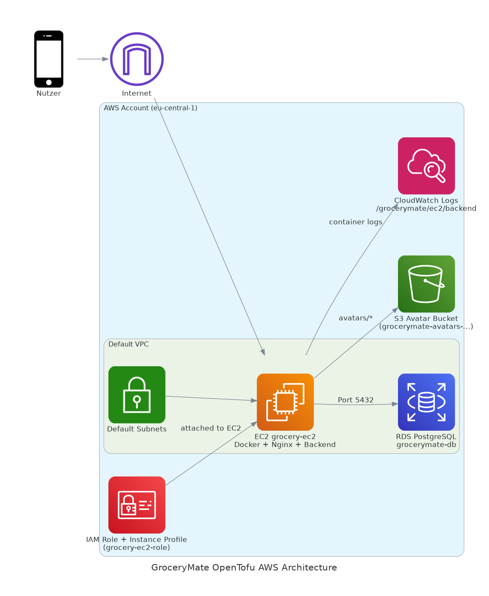

# GroceryMate Infrastruktur (OpenTofu)

## Inhaltsverzeichnis

- [Uebersicht](#uebersicht)
- [Installationsvideo](#installationsvideo)
- [Architektur](#architektur)
- [Bereitgestellte AWS-Ressourcen](#bereitgestellte-aws-ressourcen)
- [Voraussetzungen](#voraussetzungen)
- [Projektstruktur](#projektstruktur)
- [Konfiguration](#konfiguration)
- [Deployment](#deployment)
- [Outputs](#outputs)
- [CloudWatch Logging](#cloudwatch-logging)
- [Architekturdiagramm](#architekturdiagramm)
- [Sicherheitshinweise](#sicherheitshinweise)
- [Troubleshooting](#troubleshooting)
- [Aufraeumen](#aufraeumen)
- [Update](#update)

## Installationsvideo

Das Installationsvideo liegt direkt in diesem Ordner:

- [Installation.mp4](Installation.mp4)

Wenn dein Markdown-Viewer HTML unterstuetzt, kann es direkt abgespielt werden:

<video src="Installation.mp4" controls preload="metadata" width="960">
  Dein Viewer unterstuetzt kein eingebettetes Video. Nutze den Link oben.
</video>

## Uebersicht

Dieser Ordner enthaelt die Infrastructure as Code fuer **GroceryMate** mit **OpenTofu/Terraform-Syntax**.
Er erstellt die AWS-Infrastruktur fuer:

- Backend-API als Docker-Container auf EC2
- Frontend-Build statisch ueber Nginx auf EC2
- PostgreSQL auf Amazon RDS
- S3-Bucket fuer Avatar-Speicherung
- IAM-Rolle und Instance Profile fuer EC2-Zugriff auf S3
- CloudWatch Log Group fuer Backend-Container-Logs

Die EC2-Instanz wird ueber `user_data` (`init.sh.tpl`) automatisch gebootstrapped, sodass das Deployment nach `tofu apply` direkt startet.

## Architektur

1. OpenTofu bindet die Ressourcen im Default-VPC und den Default-Subnets ein.
2. Security Groups fuer EC2 und RDS werden erstellt.
3. RDS PostgreSQL wird in einer DB Subnet Group angelegt.
4. S3-Bucket sowie IAM-Rolle/Policy/Instance Profile werden angelegt.
5. CloudWatch Log Group und IAM-Rechte fuer Logs werden angelegt.
6. Die EC2-Instanz fuehrt `init.sh.tpl` aus:
   - installiert Docker, Node.js, Python, Nginx und AWS CLI
   - klont das App-Repository/Branch
   - baut und startet den Backend-Container auf Port `5000`
   - schreibt Backend-Container-Logs nach CloudWatch
   - laedt optional den Default-Avatar nach S3 hoch
   - importiert den SQL-Dump einmalig in RDS
   - baut das Frontend und liefert es via Nginx auf Port `80` aus
   - leitet `/api/` an den Backend-Container weiter

## Bereitgestellte AWS-Ressourcen

- `aws_instance.ec2`
- `aws_db_instance.postgres`
- `aws_db_subnet_group.rds_subnets`
- `aws_security_group.ec2_sg`
- `aws_security_group.rds_sg`
- `aws_s3_bucket.avatars`
- `aws_s3_bucket_public_access_block.avatars`
- `aws_s3_bucket_versioning.avatars`
- `aws_iam_role.ec2_role`
- `aws_iam_policy.ec2_s3_policy`
- `aws_iam_role_policy_attachment.ec2_s3_attach`
- `aws_iam_instance_profile.ec2_profile`
- `aws_cloudwatch_log_group.backend`
- `aws_iam_policy.ec2_cloudwatch_logs`
- `aws_iam_role_policy_attachment.ec2_cloudwatch_logs_attach`

## Voraussetzungen

- OpenTofu (`tofu`) oder Terraform-kompatible Runtime
- AWS-Account mit konfigurierten Credentials (`aws configure` oder ENV-Variablen)
- Vorhandenes EC2 Key Pair (Name)
- Gueltige AMI-ID in der gewaehlten Region
- Vorhandene Security Group `MarkusSicherheit` im Default-VPC (aktuell im Code referenziert)

Empfohlene lokale Tools:

- AWS CLI
- `psql` (fuer DB-Checks)
- SSH-Client

## Projektstruktur

```text
infrastructure/tofu/
├── main.tf          # Kernressourcen (EC2, RDS, SG, Template-Variablen)
├── s3_iam.tf        # S3-Bucket + IAM-Rolle/Policy/Profile
├── cloudwatch.tf    # CloudWatch Log Group + IAM-Rechte fuer EC2-Logs
├── variables.tf     # Eingabevariablen
├── outputs.tf       # Wichtige Outputs (EC2 IP, RDS Endpoint, S3 Bucket)
├── versions.tf      # Provider- und Versionsvorgaben
└── init.sh.tpl      # Bootstrap-Skript fuer EC2 (user_data)
```

## Konfiguration

Lege lokal eine `dev.tfvars` an (nicht committen) und setze die benoetigten Werte.

Beispiel:

```hcl
allowed_ssh_cidr   = "X.X.X.X/32"
aws_region         = "eu-central-1"
ec2_ami_id         = "ami-xxxxxxxxxxxxxxxxx"
ec2_keypair_name   = "dein-keypair-name"
db_password        = "starkes-passwort-hier"
repo_url           = "https://github.com/mhtechnik/AWS_grocery.git"
repo_branch        = "version2"
use_s3_storage     = true
cloudwatch_log_group_name = "/grocerymate/ec2/backend"
log_retention_days        = 14
```

Wichtige Variablen:

- `allowed_ssh_cidr`: deine oeffentliche IP als CIDR fuer SSH
- `ec2_ami_id`: Ubuntu-kompatible AMI in der Zielregion
- `ec2_keypair_name`: vorhandenes EC2-Keypair
- `db_password`: Passwort fuer RDS (sensitiv)
- `repo_url` / `repo_branch`: Quellrepo fuer Deployment
- `use_s3_storage`: aktiviert/deaktiviert S3-Avatar-Speicherung
- `cloudwatch_log_group_name`: Name der CloudWatch Log Group
- `log_retention_days`: Aufbewahrungsdauer der Logs in Tagen

## Deployment

Aus diesem Verzeichnis:

```bash
cd infrastructure/tofu
tofu init
tofu plan -var-file=dev.tfvars -out=plan.tfplan
tofu apply plan.tfplan
```

Outputs anzeigen:

```bash
tofu output
```

Laufzeit pruefen:

1. `http://<ec2_public_ip>` im Browser oeffnen.
2. API-Health pruefen: `http://<ec2_public_ip>/api/health`.
3. Falls noetig, per SSH auf EC2 und diese Checks ausfuehren:
   - `/var/log/user-data.log`
   - `docker ps`
   - `systemctl status nginx`

## Outputs

- `ec2_public_ip`: Oeffentliche IP der App-Instanz
- `rds_endpoint`: Endpoint der PostgreSQL-RDS-Instanz
- `s3_avatar_bucket_name`: Generierter Bucket-Name fuer Avatare
- `cloudwatch_log_group_name`: CloudWatch Log Group fuer Backend-Logs

## CloudWatch Logging

CloudWatch-Logging ist in `cloudwatch.tf` umgesetzt:

- `aws_cloudwatch_log_group.backend` erstellt die Log Group.
- Eine dedizierte IAM-Policy ermoeglicht `CreateLogStream` und `PutLogEvents`.
- Die Policy wird an die bestehende EC2-Rolle angehaengt.
- In `init.sh.tpl` startet `docker run` den Backend-Container mit `awslogs` Driver.

CloudWatch-Logs pruefen:

```bash
tofu output cloudwatch_log_group_name
aws logs tail "$(tofu output -raw cloudwatch_log_group_name)" --follow --region eu-central-1
```

## Architekturdiagramm

Im Ordner liegt ein Python-Skript mit AWS-Icons:

- `opentofu_architecture_diagram.py`
- `opentofu_aws_architecture_detailed.py`
- `opentofu_auto_diagram.py`

Es erzeugt ein PNG-Diagramm der OpenTofu-Architektur (EC2, RDS, S3, IAM, CloudWatch, VPC/Subnets).
Das zweite Skript erzeugt eine detailliertere SVG-Variante mit expliziten Datenfluessen/Ports.
Das dritte Skript generiert ein Diagramm automatisch aus den `.tf`-Dateien (inkl. Referenz-Edges).
Das Auto-Diagramm (`opentofu_auto_diagram.py`) ist aktuell als Beta zu betrachten.

Ausfuehrung:

```bash
cd infrastructure/tofu
python3 -m pip install diagrams
sudo apt-get install -y graphviz
python3 opentofu_architecture_diagram.py
python3 opentofu_aws_architecture_detailed.py
python3 opentofu_auto_diagram.py
```

Ergebnisdatei:

- `infrastructure/tofu/opentofu_aws_architecture.png`
- `infrastructure/tofu/opentofu_aws_architecture_detailed.svg`
- `infrastructure/tofu/opentofu_aws_architecture_auto.png`

Automatisch bei Struktur-Aenderungen neu generieren (Watch-Modus):

```bash
cd infrastructure/tofu
python3 opentofu_auto_diagram.py --watch --interval 2
```

Hinweis (Beta):

- `opentofu_auto_diagram.py` ist ein laufender Zwischenstand und kann sich in Struktur/Output noch aendern.

Uebersicht:



## Sicherheitshinweise

- `*.tfvars` und Secrets nicht in Git einchecken (`db_password` ist sensitiv).
- `allowed_ssh_cidr` auf die eigene IP mit `/32` begrenzen.
- Der Bucket blockiert Public Access und hat Versioning aktiviert.
- App-Port `5000` ist aktuell fuer `0.0.0.0/0` offen; falls nur Reverse Proxy genutzt wird, enger einschranken.

## Troubleshooting

- EC2 erstellt, aber App nicht erreichbar:
  - `user_data`-Log pruefen: `/var/log/user-data.log`
  - Nginx pruefen: `sudo systemctl status nginx`
  - Backend-Container pruefen: `sudo docker ps`
- Keine Logs in CloudWatch:
  - IAM-Attachment `ec2_cloudwatch_logs_attach` in AWS-Konsole pruefen
  - Region in `init.sh.tpl` (`awslogs-region`) mit deiner Region abgleichen
  - `tofu output cloudwatch_log_group_name` pruefen
- DB-Verbindung fehlschlaegt:
  - Ingress auf RDS SG muss PostgreSQL (`5432`) vom richtigen EC2 SG erlauben
  - `db_password` und DB-Variablen pruefen
- `tofu apply` fehlschlaegt wegen fehlender SG:
  - `main.tf` referenziert `data.aws_security_group.markus` mit Name `MarkusSicherheit`
  - SG zuerst anlegen oder `main.tf` anpassen

## Aufraeumen

Alle Ressourcen entfernen:

```bash
cd infrastructure/tofu
tofu destroy -var-file=dev.tfvars
```

Anschliessend im AWS-Console-Check pruefen, dass EC2, RDS und S3 entfernt sind.

## Update

- 2026-03-09: `Installation.mp4` in die Dokumentation aufgenommen und in der README verlinkt/eingebettet.
- 2026-03-09: Hinweis korrigiert, es gibt nur `opentofu_auto_diagram.py` (kein `.pyi`).
- 2026-03-09: Beta-Hinweis beibehalten, jetzt korrekt auf `opentofu_auto_diagram.py` bezogen.
